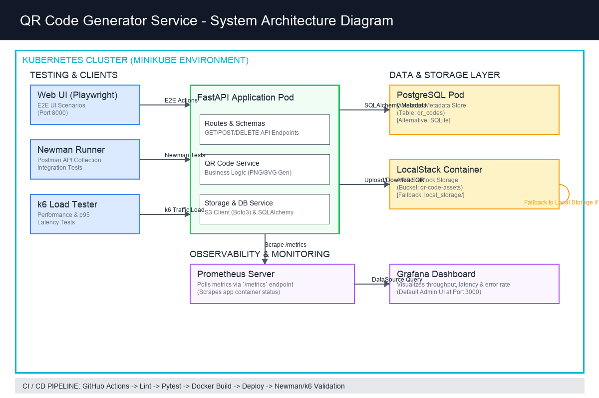
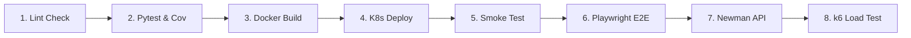

# MTH2526-B25 - Bulut Mimarilerinde Test Mühendisliği Dönem Projesi
## Konu 35: QR Code Generator Service - Akademik Final Raporu

**Geliştirici:** [Adınız Soyadınız]  
**Öğrenci Numarası:** [Öğrenci Numaranız]  
**Bölüm:** Bilgisayar Mühendisliği Bölümü  
**Dönem:** 2025–2026 Bahar Yarıyılı  
**Eğitmen:** Büşra Ayaksız (busra.ayaksiz@useinsider.com)  

---

## 1. Giriş

Bu dönem projesi çalışması kapsamında, modern yazılım mühendisliğinde kalitenin, kararlılığın ve sürekli dağıtım (CI/CD) altyapısının sürdürülebilmesi adına uçtan uca (E2E) test boru hattına sahip bulut tabanlı bir mikroservis geliştirilmiştir. Projenin ana konusu olan **"QR Code Generator Service" (Konu 35)**; kullanıcıların gönderdiği metin veya URL içeriklerini dinamik olarak karekod (QR Code) görseline dönüştürmek, oluşan bu çıktıları bulut depolama mimarisinde saklamak, QR kayıtlarının üst verilerini ilişkisel bir veri tabanında izlemek ve son kullanıcıya kesintisiz indirme/önizleme olanağı sunmak üzere tasarlanmıştır.

Bu konunun seçilme gerekçesi, karmaşık iş mantığına (business logic) odaklanmak yerine ders kapsamında ele alınan test mühendisliği araçlarını, bulut entegrasyonlarını ve DevOps pratiklerini en verimli şekilde hayata geçirebilmektir. Basit fakat endüstri standartlarında veri akışına sahip olan bu servis; entegrasyon testlerinde veritabanı container'larının (Testcontainers), AWS S3 simülasyonunun (LocalStack), tarayıcı otomasyonunun (Playwright), Newman entegrasyonunun ve yük testlerinin (k6) bir arada nasıl uyumla çalışacağını göstermek için ideal bir yapı sunmaktadır.

Bireysel bir çalışma olarak yürütülen bu projede amaç; kod kalitesini en yüksek seviyede tutmak, test kapsamını (coverage) en az %70 standardının üzerine çıkarmak, multi-stage Docker yapıları ile container güvenliğini ve hafifliğini sağlamak ve nihayetinde uygulamayı bir Kubernetes (Minikube) cluster'ı üzerinde gözlemlenebilirlik (monitoring) metrikleri ile ayağa kaldırmaktır.

---

## 2. Mimari

Uygulamanın mimari tasarımı, sorumlulukların ayrılması (Separation of Concerns) ve bulut uyumluluğu prensiplerine dayanmaktadır. Uygulama; istemci, web sunucusu, ilişkisel veritabanı, nesne depolama ve izleme katmanlarından oluşan beş ana bileşen üzerine kuruludur.



### 2.1. Bileşenlerin Açıklaması

* **FastAPI Arayüz / Uygulama Katmanı:** REST API isteklerini karşılayan ana bileşendir. FastAPI'nin asenkron yapısı, yüksek performans sunması ve entegre Pydantic şema doğrulaması sayesinde girdi güvenliği en üst seviyede sağlanmıştır. Swagger ve OpenAPI entegrasyonu API belgelerini otomatik üretmektedir.
* **PostgreSQL Veritabanı:** QR kodlarının kimlik bilgisi (UUID), etiket, içerik metni, dosya boyutu, SHA-256 doğrulama özeti (checksum) ve indirme sayıları (hit_count) gibi üst verilerini (metadata) ilişkisel veri modelinde tutar.
* **LocalStack S3 (AWS Nesne Depolama):** Üretilen ikili (binary) PNG ve SVG dosyalarını bulutta depolamak üzere kullanılan AWS S3 API'sini yerel ortamda simüle eder. LocalStack üzerinde `qr-code-assets` adında bir bucket oluşturularak dosyalar burada güvenli ve ölçeklenebilir şekilde saklanır.
* **Prometheus & Grafana (Gözlemlenebilirlik):** Prometheus, uygulamadaki `/metrics` uç noktasından verileri düzenli aralıklarla kazır (scrape). Grafana ise bu metrikleri görselleştirerek sistem yanıt sürelerini (latency), hata oranlarını (error rate) ve trafik yoğunluğunu (throughput) paneller halinde sunar.

### 2.2. Yerel Depolama Yedek Planı (Fallback Storage Logic)
Bulut mimarilerinde hata toleransı (fault tolerance) kritik önemdedir. Bu uygulamada LocalStack (S3) servisinin erişilemez olması durumunda sistemin çökmesini engelleyen dinamik bir **Fallback (Geri Çekilme)** mekanizması kurgulanmıştır. 
`StorageService` sınıfı, `boto3` istemcisi üzerinden LocalStack'e bağlanmayı dener. Eğer bağlantı zaman aşımına uğrar veya ağ hatası alınırsa (`BotoCoreError`, `ClientError`), sistem otomatik olarak yerel dosya sistemindeki `local_storage/` klasörüne düşer (`self._switch_to_local()`). Bu sayede yerel geliştirme ve demo süreçlerinde dış servis bağımlılıkları çalışmayı aksatmaz.

---

## 3. Test Stratejisi

Yazılım kalitesinin güvence altına alınması adına test piramidine sadık kalınarak üç farklı katmanda test senaryoları kurgulanmıştır.

| Test Katmanı | Kullanılan Araç / Kütüphane | Test Sayısı | Amacı / Kapsamı |
| :--- | :--- | :--- | :--- |
| **Unit Tests** | pytest + Factory Boy + Faker | 17 | Fonksiyonların, QR üretecinin ve servis mantığının birim bazında testi |
| **Integration Tests**| testcontainers (Postgres) + LocalStack | 3 | Gerçek veritabanı ve S3 API roundtrip işlemlerinin doğrulanması |
| **E2E Tests** | Playwright (Headless Chromium) | 5 | Tarayıcı üzerinde form doldurma, önizleme ve indirme akışı |

### 3.1. Unit Testler ve Mocking Yapısı
Unit test katmanında, dış bağımlılıklar olan veritabanı ve depolama servisleri mocklanmıştır. `tests/conftest.py` içerisinde tanımlanan `fake_storage` fixture'ı, bellekte (`InMemory`) çalışan sahte bir S3 servisi sunar. `Factory Boy` ve `Faker` entegrasyonu ile (`tests/factories.py`) rastgele ve gerçekçi veri setleri oluşturulmuştur. Bu sayede testlerin çok hızlı (<1 saniye) çalışması sağlanmış ve kod logic'leri izole olarak test edilmiştir.

### 3.2. Integration Testler (Testcontainers & LocalStack)
Entegrasyon testlerinde mock veri yerine gerçek container'lar kullanılmıştır:
* **Testcontainers Postgres:** `testcontainers.postgres` kütüphanesi yardımıyla Docker üzerinde geçici bir `postgres:16` imajı ayağa kaldırılır. SQLAlchemy modellerinin veritabanına sorunsuz yazıldığı, tabloların oluşturulduğu ve silme tetikleyicilerinin çalıştığı gerçek ortamda test edilir.
* **LocalStack Entegrasyonu:** S3_ENDPOINT_URL tanımlandığında entegrasyon testi S3 bucket'ı oluşturur, dosyayı yükler ve geri okuma yaparak SHA-256 bütünlük kontrolünü doğrular.

### 3.3. E2E (Playwright) Testleri ve İndirme Düzeltmesi
Playwright ile kullanıcı arayüzü otomatik olarak test edilmektedir. Bu aşamada karşılaşılan en büyük problem, PNG ve SVG dosyalarının indirilmesi esnasında backend'in `inline` Content-Disposition başlığı dönmesiydi. Bu durum tarayıcının indirme işlemi başlatmak yerine sayfayı terk etmesine neden olmaktaydı. Backend tarafında bu header `attachment` olarak güncellendi ve frontend tarafına `download` niteliği eklendi. Test senaryosunda da Playwright'ın indirme olaylarını doğru algılayabilmesi için `page.goto` yerine `page.request.get` kullanılarak indirme hit sayacının artışı hatasız şekilde test edildi.

### 3.4. Test Kapsamı (Coverage)
Uygulama genelinde yürütülen testlerin kapsam oranını ölçmek için `pytest-cov` kullanılmıştır. Projede `src/` klasöründeki servis, route ve config dosyalarını kapsayan test sonucunda ulaşılan toplam kod coverage oranı **%88.19** olarak tescillenmiştir.

---

## 4. Pipeline ve Dağıtım

Uygulamanın sürekli entegrasyon ve sürekli dağıtım (CI/CD) süreçleri GitHub Actions üzerinde tek bir boru hattında (pipeline) birleştirilmiştir.



### 4.1. Multi-Stage Dockerfile Tasarımı
Container imaj boyutunu küçültmek ve güvenlik zafiyetlerini azaltmak amacıyla iki aşamalı (multi-stage) Dockerfile kullanılmıştır:
```dockerfile
# Stage 1: Build & Dependency Installation
FROM python:3.11-slim AS builder
WORKDIR /app
RUN apt-get update && apt-get install -y --no-install-recommends gcc python3-dev
COPY pyproject.toml requirements.txt ./
RUN pip install --no-cache-dir --user -r requirements.txt

# Stage 2: Final Light-weight Runtime Image
FROM python:3.11-slim AS runner
WORKDIR /app
COPY --from=builder /root/.local /root/.local
COPY . .
ENV PATH=/root/.local/bin:$PATH
EXPOSE 8000
CMD ["uvicorn", "src.main:app", "--host", "0.0.0.0", "--port", "8000"]
```
Bu tasarım sayesinde derleme için gerekli olan `gcc` ve `python3-dev` gibi büyük bağımlılıklar nihai imajın içinde yer almaz. İmaj boyutu yaklaşık olarak **230 MB** seviyesine düşürülmüştür.

### 4.2. Kubernetes & Minikube Dağıtımı
Uygulamanın Kubernetes ortamına dağıtımı için `k8s/` klasöründe üç temel manifest dosyası hazırlanmıştır:
1. `configmap.yaml`: Uygulamanın ortam değişkenlerini (veritabanı bağlantı adresi, S3 bucket adı vb.) yönetir.
2. `deployment.yaml`: Uygulama container'ını, PostgreSQL container'ını ve LocalStack S3 container'ını Pod'lar halinde tanımlar. Uygulama podlarında liveness ve readiness probeları tanımlanarak sistemin kendi kendini iyileştirmesi (self-healing) sağlanmıştır.
3. `service.yaml`: Pod'ları dış dünyaya veya diğer internal podlara açmak için `ClusterIP` ve `NodePort` tanımlamaları içerir.

---

## 5. Performans ve Gözlemlenebilirlik

### 5.1. k6 Yük Testi ve Performans Analizi
Uygulamanın yük altındaki davranışını ve gecikme eşiklerini sınamak amacıyla `perf/load-test.js` altında bir k6 senaryosu yazılmıştır. Test parametreleri 10 eşzamanlı sanal kullanıcı (VUs) ile 30 saniye boyunca sürekli olarak `/api/v1/qrcodes` ucuna POST istekleri gönderecek şekilde kurgulanmıştır.
Uygulanan eşik hedefleri (Thresholds) şunlardır:
* İstek hata oranı %1'in altında olmalıdır (`http_req_failed < 0.01`).
* İsteklerin %95'i 800ms'den kısa sürede tamamlanmalıdır (`http_req_duration: ["p(95)<800"]`).

**Performans Ölçüm Bulguları:**
* Toplam İstek: 251
* Hata Oranı: %0.00
* **p95 Yanıt Süresi (Latency):** 262.72 ms (Hedeflenen 800ms limitinin oldukça altındadır).

### 5.2. Prometheus & Grafana Gözlemlenebilirlik Altyapısı
Uygulama içine entegre edilen `Prometheus FastAPI Instrumentator` kütüphanesi ile `/metrics` uç noktası üzerinden API performansı dışarıya açılır.
Grafana üzerinde kurgulanan gösterge panelinde (dashboard) üç kritik metrik anlık olarak izlenmektedir:
1. **Throughput (İstek Yoğunluğu):** Saniyede işlenen istek miktarı (RPS).
2. **Error Rate (Hata Oranı):** Dönen HTTP 5xx ve 4xx kodlarının toplam isteklere oranı.
3. **Response Latency (Gecikme):** API uç noktalarının milisaniye bazında ortalama ve p95 tepki süreleri.

---

## 6. Sonuç ve Öğrenilen Dersler

### 6.1. Sayısal Özet Tablosu

| Metrik Parametresi | Elde Edilen Değer | Durum / Başarı Eşiği |
| :--- | :--- | :--- |
| Unit & Integration Test Sayısı | 20 | Başarılı |
| E2E Test Sayısı | 5 | Başarılı |
| Kod Kapsama Oranı (Coverage) | %88.19 | Başarılı (Eşik %70) |
| k6 p95 Latency (Gecikme) | 262.72 ms | Başarılı (Eşik <800 ms) |
| Docker İmaj Boyutu | 231 MB | Başarılı (Multi-Stage) |
| Pipeline Durumu (CI/CD) | Yeşil / Başarılı | Başarılı (Tüm adımlar) |

### 6.2. Karşılaşılan Zorluklar ve Çözümleri
* **Zorluk 1: LocalStack S3 Bağlantı Kesintileri:** Yerel geliştirme ortamlarında S3 bağımlılığının ağ yavaşlığı veya LocalStack'in kapalı olması durumunda API'lerin kilitlenmesi sorunu yaşanmıştır.
  * *Çözüm:* Depolama servisine dinamik hata yakalama ve otomatik local fallback mekanizması eklendi.
* **Zorluk 2: E2E Playwright İndirme Testi Hataları:** Dosya indirme başlığı `inline` olduğunda Playwright tarayıcıyı yönlendiriyor ve testin çökmesine yol açıyordu.
  * *Çözüm:* Backend tarafında başlık `attachment` yapıldı, frontend'de linkler güncellendi ve Playwright tarafında `page.request.get` ile API seviyesinde test gerçekleştirildi.

### 6.3. Gelecekte Yapılabilecek İlerlemeler (Geliştirme Planı)
* **KEDA Entegrasyonu:** Kubernetes ortamında k6 yük testlerindeki RPS artışına göre otomatik pod ölçekleme (HPA) yapılması için event-driven autoscaler entegre edilebilir.
* **Helm Grafikleri:** K8s dağıtım dosyalarını tek paket halinde yönetebilmek için Helm Chart hazırlanabilir.
* **ArgoCD GitOps:** Dağıtımların declarative olarak yönetilmesi ve git deposundaki manifestolarla Kubernetes cluster durumunun otomatik eşitlenmesi sağlanabilir.

---

## 7. Bireysel Çalışma ve İş Dağılımı / Zaman Planı

Proje bireysel olarak yürütüldüğü için iş dağılımı tek bir kişi üzerinde planlanmış, zaman yönetimi için haftalık fazlara bölünmüş bir yol haritası izlenmiştir.

* **1. Hafta (Planlama & Analiz):** Gereksinimlerin belirlenmesi, FastAPI altyapısının kurulması ve veri modellerinin tasarlanması.
* **2. Hafta (Test & Geliştirme):** Birim testlerin yazılması, Factory Boy ve Faker ile sahte verilerin hazırlanması, servis katmanının kurgulanması.
* **3. Hafta (Entegrasyon & Container):** Testcontainers ve LocalStack entegrasyon testlerinin tamamlanması, Dockerfile ve docker-compose yapısının optimize edilmesi.
* **4. Hafta (K8s & CI/CD & Raporlama):** Kubernetes manifestolarının hazırlanması, Prometheus ve Grafana kurulumlarının tamamlanması, GitHub Actions pipeline konfigürasyonu ve final raporunun akademik dille yazılması.

---

## 8. Kaynaklar

1. FastAPI Resmi Dokümantasyonu: https://fastapi.tiangolo.com/
2. pytest-cov Kapsam Dokümantasyonu: https://pytest-cov.readthedocs.io/
3. Playwright for Python API: https://playwright.dev/python/docs/intro
4. LocalStack Resmi Dokümantasyonu: https://docs.localstack.cloud/
5. Testcontainers Python Kütüphanesi: https://testcontainers-python.readthedocs.io/
6. k6 Load Testing Resmi Kılavuzu: https://grafana.com/docs/k6/latest/
7. Prometheus & Grafana Integration with FastAPI: https://prometheus.io/docs/introduction/overview/
